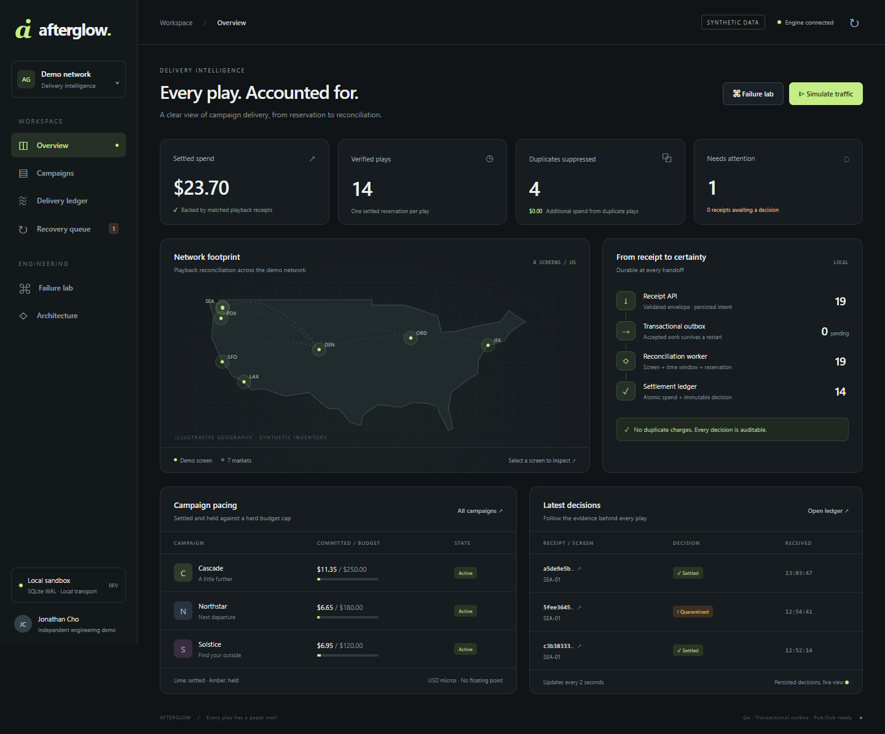
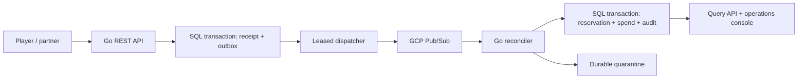

# Afterglow

[](https://github.com/jon-jc/afterglow/actions/workflows/ci.yml?query=branch%3Amain+event%3Apush)

### Every play. Accounted for.

A Go backend and operations console for digital out-of-home playback reconciliation. Reserve campaign budget, accept partner receipts durably, and settle only when the evidence matches. Then break the pipeline and watch it recover.

**Go · GCP Pub/Sub · PostgreSQL · Cloud Run · Terraform · OpenTelemetry**



## The problem

A digital ad can be reserved, displayed, and reported by different systems. Reports arrive late. Brokers redeliver. A worker can commit a charge and crash before acknowledging. A partner can send a new event ID for the same play.

Afterglow gives those ambiguities explicit outcomes: settled, duplicate, quarantined, or recoverable failure. A campaign's reserved plus settled spend cannot exceed its budget. A receipt cannot invent its own price.

This is an independent, production-oriented engineering demo with synthetic campaigns and inventory. It is not a CCO product, a certified Vistar integration, a real billing system, or an audience-attribution model. [Research and public sources](docs/research.md).

## Start with a double-click (Windows)

Double-click **Start Afterglow.cmd** in this folder. It prepares the app, starts it in the background, and opens your browser. Clicking it again reopens the running app. You can close the launcher window.

Double-click **Stop Afterglow.cmd** to stop the local app. Your saved data stays in the `data` folder. Go 1.27+ must be installed for a fresh start; no Docker or Node setup is needed. If another application occupies port 8090, the launcher explains the conflict without stopping it. Startup logs are in `artifacts/launcher-8090*.log`.

The launcher is for the local SQLite demo. It explicitly selects local transport and does not use deployment database credentials. To rebuild after editing code, stop and start again.

## Run from a terminal

Requires Go 1.27 or later (aligned with the verified security scan and container build).

```sh
go run ./cmd/afterglow
```

Open **http://127.0.0.1:8090** and choose **Live proof**. The local run uses persistent SQLite and a SQL-backed worker queue. It requires no cloud account, Docker, frontend build or Node runtime.

**GoLand:** open this folder, let the Go module index, and run the checked-in **Afterglow** configuration. Set breakpoints in `Reserve`, `Accept`, and `Process`. Windows users can also run `./scripts/start.ps1`.

**Campaign assurance:** inspect full retained campaign delivery by screen, reconcile balances to reservations, and export operational evidence. Includes explainable follow-up for held plays and partner exceptions. [Design and scope](docs/campaign-assurance.md).

**Live proof:** choose **Live proof** for a six-stage, resumable run against the Go API: reserve, accept, retry, reconcile, correct, and verify. Each run uses two cents of synthetic budget and exports the observed evidence.

**Partner intake:** choose one of six scenarios and click **Load example**. Set the reservation price ($0.01–$10.00 demo cap; default $0.01). Loading prepares a synthetic reservation automatically; repeated loads at the same price reuse the unsent hold. Changing price creates a new hold without modifying existing reservations. Click **Send batch** to exercise valid playback, partial success, duplicate plays, event replay, unsupported schemas, or invalid play windows against the real Go API. Inspect per-item results, retry unchanged identities, and follow asynchronous decisions in the ledger. The optional airport reference service remains a standalone backend experiment; its console section has been removed.

For PostgreSQL plus the official Pub/Sub emulator, see [operations](docs/operations.md). `TRANSPORT=pubsub` uses the Google Go v2 client. The local transport never claims to be Pub/Sub.

## Try the failures

| Scenario | What it proves |
|---|---|
| **Duplicate delivery** | Five event IDs for one reservation produce one charge. |
| **Crash after commit** | Redelivery after a lost acknowledgement does not change spend. |
| **Unsupported schema** | Invalid evidence is preserved and quarantined, not silently billed. |
| **Transient failure** | Bounded retries become a recoverable exception. |
| **Worker interruption** | Accepted receipts remain durable while processing is paused. |
| **Concurrent budget pressure** | 32 simultaneous reservation requests cannot overspend a campaign. |

Fault controls are local-demo-only. Run one scenario at a time with an empty queue. The receipt detail view shows the original payload, decision and processing attempts. Replay never bypasses validation.

## Design



- **202 is a precise promise.** Receipt and dispatch intent committed to SQL. Broker delivery and settlement happen later.
- **Partial success is explicit.** The batch receipt endpoint returns a result for each item, retains accepted neighbors and supports safe retries with unchanged identities.
- **At-least-once delivery; one financial effect.** Event identity and reservation state guard against duplication.
- **Money is integer micros.** Reservation prices are immutable. SQL enforces `spent + reserved <= budget`.
- **Failure has an owner.** Dispatch leases have fencing tokens. Stale workers cannot overwrite newer claims.
- **The audit participates in the transaction.** If the audit write fails, the charge rolls back with it.
- **Operational costs are bounded.** Request size/concurrency limits, a local rate limiter, bounded retries, expiry sweeps, and bounded reads.
- **Traces cross the asynchronous boundary.** Trace context is stored with dispatch intent and carried through Pub/Sub. Metrics use bounded outcome labels.

[Detailed decisions](docs/architecture.md) · [REST contract](api/openapi.yaml) · [Operations and production gaps](docs/operations.md)

## Verify

```sh
go test ./...
go vet ./...
go test -race -count=1 ./...   # supported compiler/toolchain required
node scripts/smoke.mjs        # isolated server + database, Node 22+
go run ./cmd/rehearsal        # requires REHEARSAL_DATABASE_URL: local PostgreSQL test DB
```

Set `TEST_DATABASE_URL` to an isolated PostgreSQL database to run core invariants against PostgreSQL. Set `TEST_PUBSUB_EMULATOR_HOST` to run the transport test against the official emulator. Otherwise, it uses Google's `pstest` gRPC server.

Verified locally: Go tests, static checks, the full race suite on Linux, core concurrency tests against PostgreSQL 18.6, real Google SDK calls against `pstest`, 13 HTTP end-to-end checks, and Terraform provider-schema validation. Browser checks cover traffic simulation, duplicate delivery, quarantine/replay and manual reservation. See [verification evidence](docs/verification.md).

**GitHub Actions is configured but could not start because of the account billing/spending-limit setting.** No cloud deployment or Vistar certification is claimed.

## Repository map

```text
cmd/afterglow        HTTP service, worker lifecycle and configuration
cmd/bootstrap        Emulator-only Pub/Sub provisioning
internal/core       SQL transactions, schema, outbox leases, invariant tests
internal/pipeline   Pub/Sub adapter, dispatch, retries and fault injection
internal/httpapi    REST boundary, authentication and local demo endpoints
internal/console    Embedded, offline-capable operations console
internal/telemetry  Optional OTLP tracing and context propagation
deploy/terraform   Cloud Run, Pub/Sub, IAM and existing SQL/secret bindings
scripts             Local launch and isolated end-to-end verification
docs                Design, research, operations and interview walkthrough
```

